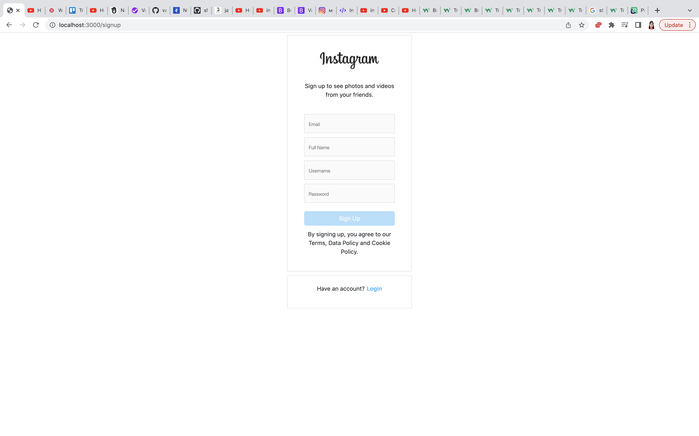
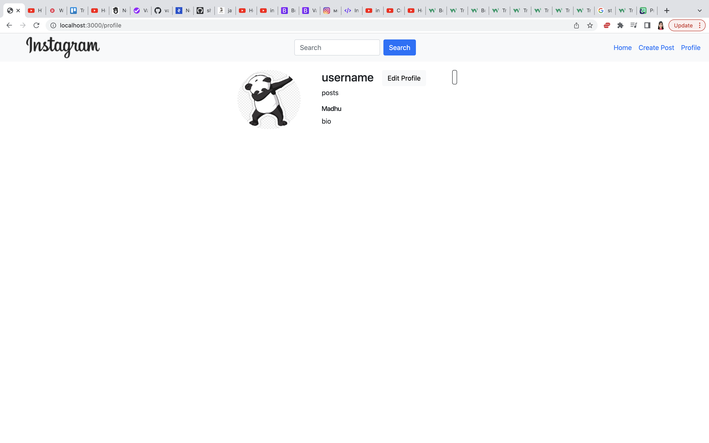

# BOOK SPACE

### Live Link

### Technologies: 

- Html
- Css
- Bootstrap
- JavaScript
- express
- mongoose
- mongoDB
- jQuery
- Google Fonts
- FontAwesome

### API:

### Features:
  - Signup to create an account in instagram
  - Login to get into the instagram home page
  - Display posts created 
  - Has the ability to create, view, edit and delete post
  - Add and manage favorite posts in MongoDB
  - Has a Sticky Header
  - Has search functionality to search other profiles
  - Has the ability to view and edit profile

### Screenshots:

##### Login Page

##### Signup Page

##### Profile Page

### Stretch Goals/Future Goals: 
  

