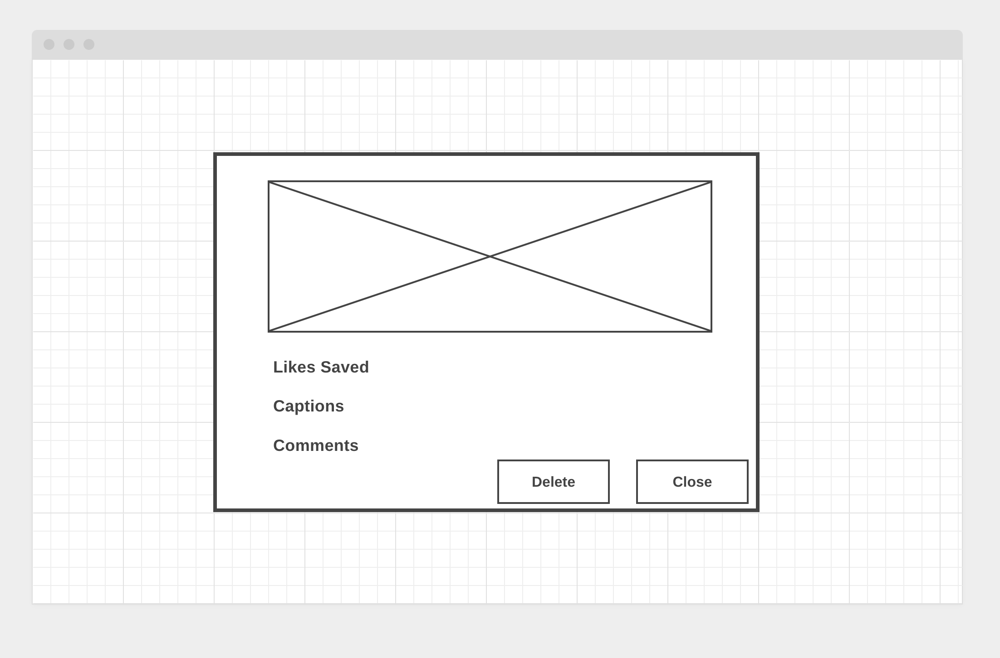

# I-Gram

### Live Link

https://igram-clone-ga.herokuapp.com/

### Technologies: 

- Html
- Css
- Bootstrap
- JavaScript
- nodeJS
- express
- mongoose
- mongoDB
- jQuery
- Google Fonts
- FontAwesome

### Features:
  - Signup to create an account in instagram
  - Login to get into the instagram Profile page
  - Has Logout functionality
  - Displays post created 
  - Displays saved post
  - Displays other user's post in home feed
  - Has the ability to create, view, edit and delete post
  - Add and manage favorite posts
  - Add and manage saved posts
  - Has the ability to add comments on other user post
  - Displays Comments on post added by other user profiles
  - Has a Sticky Header
  - Has the ability to view and edit user profile

### Screenshots:

##### Login Page

##### Signup Page

##### Landing Page

##### Profile-Post Page

##### Profile-Saved Page

##### Create Post Page

##### Edit Profile Page

##### Show-Post with Delete Functionality

### Stretch Goals/Future Goals: 
   - Search functionality to look for other user profiles
   - Create Responsive Design
   - Display advertisements using API

